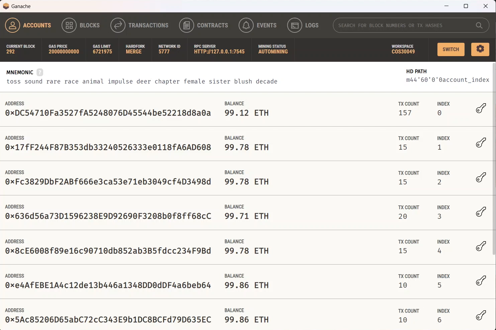

<h1>Decentralised Trading Platform - Backend</h1>

   


<br>

<details id="nav" open>
<summary><b>Contents</b></summary><br>

- [**Overview**](#overview)
- [**Installation**](#installation) 
- [**Getting started**](#getting-started)
- [**APIs**](#apis)
- [**Members/Contributors**](#memberscontributors) 
- [**Licence**](#licence)

</details>

## Overview
<sup>[**\[ Back to Contents  ↑ \]**](#nav)</sup>

**CRYPTOX** is a decentralised trading platform that utilises blockchain and smart contract technology.

#### Core Functionalities
- Store digital assets and their metadata and user data in MySQL database
- Smart contracts to act as escrow during the trading process
- Frontend integration

<br>



## Installation
<sup>[**\[ Back to Contents  ↑ \]**](#nav)</sup>

- The backend component requires [`Python`](https://www.python.org/downloads). Please make sure that your `Python` version is at least `3.9.18`. Additionally, `conda` is used as a virtual environment to manage packages. This is supported via [`Anaconda`](https://www.anaconda.com/download).
- Download [`MySQL`](https://dev.mysql.com/downloads/mysql) which is used to manage relational database.
- Testing of smart contracts is done with [`Remix`](https://remix.ethereum.org) and [`Ganache`](https://trufflesuite.com/ganache/).

### Set up environment.
There are two options to setup the environment.

#### OPTION 1: Default setup
***a. Create environment.***

Either one of the following:
- Locate the project directory, create a folder with name i.e., 'env'
  ```
  conda create -p path\to\project\env python=3.9
  ```

- Create the environment in conda default directory with name i.e, ‘env’. You can skip to **step b** "Activate environment" if you create in this way.
  ```
  conda create --name env python=3.9
  ```

Add the project directory path to envs_dirs config (do this once)
```
conda config --add envs_dirs path\to\project
```

Set the prompt name.
```
conda config --set env_prompt '({name})'
```

***b. Activate environment.***
```
conda activate env
```


***c. Install packages with conda.***
- Fastapi:
  ```
  conda install -c conda-forge fastapi
  conda install -c "conda-forge/label/cf202003" fastapi
  ```

- Uvicorn:
  ```
  conda install -c conda-forge uvicorn-standard
  ```

***d. Install packages with pip***
- Web3:
  ```
  pip install web3
  ```

- py-solc-x:
  ```
  pip install py-solc-x
  ```

#### OPTION 2: Create from environment.yml file from submission zip file. (Not recommend if you are Mac user)
Run this in Anaconda Prompt.
```
conda env create -f path_to_environment.yml
```

### Setup database
In MySQL prompt, run
```
mysql -u <yourusername> -p <yourpassword> < deploy/deApp.sql
```

or simply copy the content of the aforementioned file then paste it to MySQL prompt that has already been logged in.

### Set up Ganache

There is a folder file named COS30049 under `deploy`. Move the folder to: 
- `%appdata%\Ganache\ui\workspaces` (Windows)
- `~/Library/Application Support/Ganache` (MacOS/Linux)

## Getting started
<sup>[**\[ Back to Contents  ↑ \]**](#nav)</sup>

>⚠️ **This project/software requires further steps in the [frontend component](https://github.com/COS30049/cos30049_frontend) to be fully functional.**

- Open `Ganache` and select the workspace named 'COS30049'.
- Start the backend server by running this command in the activated `conda` environemt **(env)**
  ```
  uvicorn main:app
  ```

## APIs
<sup>[**\[ Back to Contents  ↑ \]**](#nav)</sup>
### Login API
This is an API to send user’s login data to the server and verify it against existing data of server’s database.

***Endpoint:***
```
URL: http://127.0.0.1:8000/login/
METHOD: POST
``` 

***Request body:***
```
{
  "username": "your-username",
  "password": "your-password"
}
```

***Response:***
<table>
    <tr>
        <th>Code</th>
        <th>Details</th>
        <th>Comment</th>
    </tr>
    <tr>
        <td>200</td>
        <td width=800>

```
{
   "message": "Welcome back, your-username"
}
```
</td>
    <td width=150 align=center>Successful login</td>
    </tr>
        <tr>
        <td>200</td>
        <td width=800>

```
{
  "error": "Sorry, your username 'your-username' is not found, 
  or your password is incorrect!"
}
```
</td>
    <td width=150 align=center>Unsuccessful login</td>
    </tr>
        <tr>
        <td>422</td>
        <td width=800>

```
{
  "detail": [
    {
      "loc": [
        "string",
        0
      ],
      "msg": "string",
      "type": "string"
    }
  ]
}
```
</td>
    <td width=150 align=center>Validation Error</td>
    </tr>

</table>

### Signup API
<sup>[**\[ Back to Contents  ↑ \]**](#nav)</sup>

This is an API to send user’s signup data to the server and insert it into the existing data of server’s database.

***Endpoint:*** 
```
URL: http://127.0.0.1:8000/signup/
METHOD: POST
```

***Request body:***
```
{
  "username": "your-username",
  "password": "your-password",
  "token": "your-public-key"
}
```
***Response:***

<table>
    <tr>
        <th>Code</th>
        <th>Details</th>
        <th>Comment</th>
    </tr>
    <tr>
        <td>200</td>
        <td width=800>

```
{
   "message": "Welcome, your-username"
}
```
</td>
    <td width=150 align=center>Successful signup</td>
    </tr>
        <tr>
        <td>200</td>
        <td width=800>

```
{
  "error": "Error: 1048 (23000): Column 'token'     
  cannot be null"

}
```
</td>
    <td width=150 align=center>Unsuccessful signup</td>
    </tr>
        <tr>
        <td>422</td>
        <td width=800>

```
{
  "detail": [
    {
      "loc": [
        "string",
        0
      ],
      "msg": "string",
      "type": "string"
    }
  ]
}
```
</td>
    <td width=150 align=center>Validation Error</td>
    </tr>

</table>

### Get Account API
<sup>[**\[ Back to Contents  ↑ \]**](#nav)</sup>

This is an API to send user’s signup data to the server and insert it into the existing data of server’s database.

***Endpoint:***
```
URL: http://127.0.0.1:8000/account/
METHOD: POST
```

***Request body:***
```
{
  "username": "myUsername"
}
```
 
***Response:***
<table>
    <tr>
        <th>Code</th>
        <th>Details</th>
        <th>Comment</th>
    </tr>
    <tr>
        <td>200</td>
        <td width=800>

```
{
  "username": "myUsername",
  "token": "found-user-public-key"
}
```
</td>
    <td width=150 align=center>User found</td>
    </tr>
        <tr>
        <td>404</td>
        <td width=800>

```
{
  "detail": "User with username 'myOtherUsername' not found!"
}
```
</td>
    <td width=150 align=center>User not found</td>
    </tr>
        <tr>
        <td>422</td>
        <td width=800>

```
{
  "detail": [
    {
      "loc": [
        "string",
        0
      ],
      "msg": "string",
      "type": "string"
    }
  ]
}
```
</td>
    <td width=150 align=center>Validation Error</td>
    </tr>

</table>

### Get Assets API
<sup>[**\[ Back to Contents  ↑ \]**](#nav)</sup>

This is an API to fetch all assets.

***Endpoint:***
```
URL: http://127.0.0.1:8000/assets/
METHOD: GET
```

***Response:***
<table>
    <tr>
        <th>Code</th>
        <th>Details</th>
        <th>Comment</th>
    </tr>
    <tr>
        <td>200</td>
        <td width=800>

```
[
   {
      "asset-id": "asset-1",
      "name": "my song",
      "price": 0.2,
      "volume": 0.2,
      "description": "my first song",
      "category": "Music"
   },
   {
      "asset-id": "asset-2",
      "name": "my game",
      "price": 0.5,
      "volume": 0.5,
      "description": "an indie game",
      "category": "Game"
   }
]
```
</td>
    <td width=150 align=center>Assets available</td>
    </tr>
        <tr>
        <td>200</td>
        <td width=800>

```
{
  "message": "No assets available!"
}
```
</td>
    <td width=150 align=center>No assets available</td>
    </tr>
</table>

### Buy Assets API Endpoint
<sup>[**\[ Back to Contents  ↑ \]**](#nav)</sup>

This is an API to be called when user click on button buy

***Endpoint:***
```
URL: http://127.0.0.1:8000/buy/
METHOD: POST
``` 

***Request body:***
```
{
 "account_token": "user_token"
 "asset_id": "string"
 "price": 123
}
```

***Response:***
<table>
    <tr>
        <th>Code</th>
        <th>Details</th>
        <th>Comment</th>
    </tr>
    <tr>
        <td>200</td>
        <td width=800>

```
{
  1
}
```
</td>
    <td width=150 align=center>Buy success, account is affordable</td>
    </tr>
        <tr>
        <td>200</td>
        <td width=800>

```
{
  0
}
```
</td>
    <td width=150 align=center>Transaction Fail</td>
    </tr>
</table>


## Members/Contributors
<sup>[**\[ Back to Contents  ↑ \]**](#nav)</sup>

| Name                 | Student ID | Email                         |
| :------------------- | ---------- | :---------------------------: |
| Minh Nguyen `LEADER` | 103534696  | 103534696@student.swin.edu.au |
| Ryan Vu              | 103511424  | 103511424@student.swin.edu.au |
| Hoang Bao Phuc Chau  | 103523966  | 103523966@student.swin.edu.au |

## Licence
<sup>[**\[ Back to Contents  ↑ \]**](#nav)</sup>

This project/software is provided under `MIT Licence`.